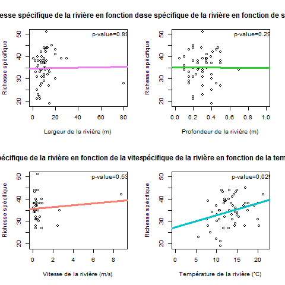
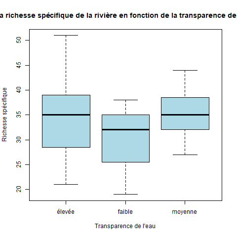
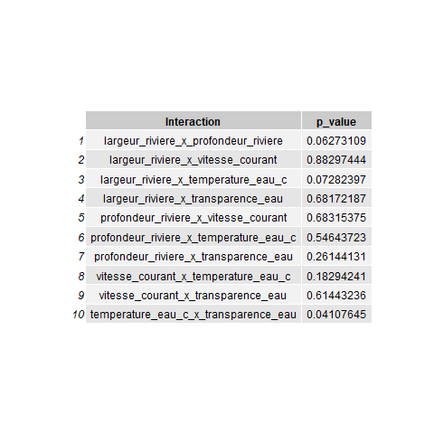
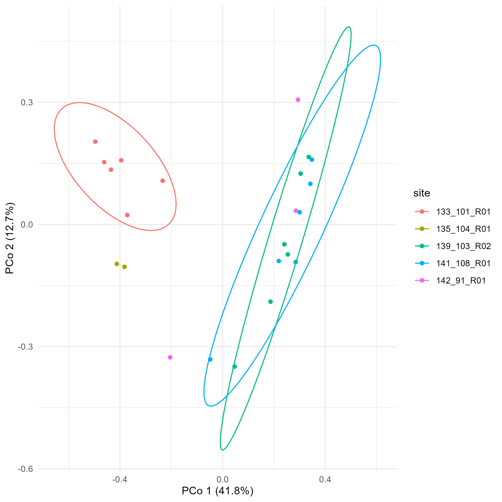

This PNAS journal template is provided to help you write your work in the
correct journal format. Instructions for use are provided below.

Note: please start your introduction without including the word
"Introduction" as a section heading (except for math articles in the
Physical Sciences section); this heading is implied in the first
paragraphs.

Guide to using this template {.unnumbered}
========================================

Please note that whilst this template provides a preview of the typeset
manuscript for submission, to help in this preparation, it will not
necessarily be the final publication layout. For more detailed
information please see the [PNAS Information for
Authors](http://www.pnas.org/site/authors/format.xhtml).

Emma (introduction, pas de titre pcq c'est ce qui est recommandé dans le template de l'article et je trouvais que ça ferait professionnel)

### Méthodes {#méthodes .unnumbered}

Le jeu de données utilisé contient une partie des inventaires du benthos faits par le ministère de l'Environnement, de la Lutte contre les Changements Climatiques, de la Faune et des Parcs (MELCCFP) dans le cadre du suivi de la qualité de l'eau des rivières du Québec. Ces données, extraites du site Biodiversité Québec, recensent les espèces de macroinvertébrés benthiques vivant dans les rivières du Québec. L'échantillonnage a été réalisé en suivant le protocole d’échantillonnage des macroinvertébrés benthiques d’eau douce du Québec. 

Avant l'analyse des données, celles-ci sont passées à travers plusieurs étapes de manipulations. Premièrement, les données, extraites sous forme d'une multitude de fichiers .csv, ont été manipulées pour être jointes en une seule matrice. Deuxièmement, la matrice a été nettoyée, notamment en assignant une classe pertinentes aux valeurs de la matrice (ex: les dates en format 'Date' et non en format 'Character'), en enlevant les colonnes importunes (ne contenant que des NAs ou étant des doublons) et en remplaçant les données problématiques par des NAs (valeurs de -99 pour des variables ayant des valeurs réalistiquement positives). Troisièmement, des numéros d'identification (IDs) ont été assignés pour toutes les combinaisons de dates, de sites et d'heures. Finalement, une base de données .db a été créer pour entreposer deux tables : une tables contenant des informations reliées aux IDs de sites et une table contenant des informations sur les abondances des taxons de benthos identifiés.

Différentes analyses ont été performées sur les données pour répondre aux questions posées par ce rapport. D'abord, des régressions linéaires simples (p=0.05) de la richesse spécifique ont été produites en fonction des variables suivantes : la largeur de la rivière, la profoncdeur de la rivière, la vitesse du courant et la température de l'eau. Ensuite, un diagramme à moustache validé par un test de t avec un interval de confiance de 0.95 a été réalisé pour la richesse spécifique en fonction de la transparence de l'eau. Puis, une vérification d'intéractions pour toutes les combinaisons possibles de variables abiotiques a été conduite avec des régressions linéaires simples (p=0.05). La majorité des variables (toutes sauf la température de l'eau) n'ont pas une distribution normale. Toutefois, suite à des tests de régressions linéaires généralisées avec différentes familles (par exemple la poisson), nous en sommes venues à la conclusion que les erreurs avaient une plus belle distribution (normale) lorsque nous utilisions la régression linéaire simple. Finalement, une ordination de type PCoA (Principal Coordinates Analysis) de la composition en abondance des communatés benthiques a été produite seulement avec les échantillons pris plus d'une fois (à des moments différents) sur un même site. Aucun tests statistiques n'a été réalisé pour confirmer la significativité des observations permises par l'outil de visualisation qu'est l'ordination. 

### Résultats {#résultats .unnumbered}

Nous avons d'abord testé l'effet des différentes variables abiotiques (largeur de la rivière, profondeur de la rivière, transparence de l'eau, température de l'eau et vitesse du courant) sur la richesse spécifique des échantillons analysés. Les régressions linéaires à la figure \ref{fig:regression_richesse} nous permettent d'observer un effet significatif pour la variable de la température, mais pas pour les autres. 

L'effet de la transparence a été visualié en diagramme à moustache plutôt qu'en régression linéaire. Il s'avère que cette variable n'affecte pas non plus significativement la richesse spécifique des communautés de benthos.

Ensuite, nous avons vérifié s'il y avait des interactions entre les variables. Selon le tableau de la figure \ref{fig:tableau_interaction}, il n'y a aucune interaction significative entre les variables abiotiques en ce qui concerne la richesse spécifique des échantillons.

Finalement, la diversité beta a été observé à l'aide d'une ordination PCoA. À l'oeil, sur la figure \ref{fig:ordination_sites}, certains sites semblent avoir des commuanutés de benthos similaires entre les différentes périodes d'échantillonnages, alors que d'autres sont plutôt variées. Entre-eux, les sites sont parfois très proches en terme de composition même s'ils sont différents géographiquement, d'autres fois complètement différents. 

### Discussion {#discussion .unnumbered}

Laura et Cloé

<!-- Leave these lines as they are at the end of your .Rmd file to ensure placement of methods & acknowledgements sections before the references-->
\showmatmethods
\showacknow
\pnasbreak
